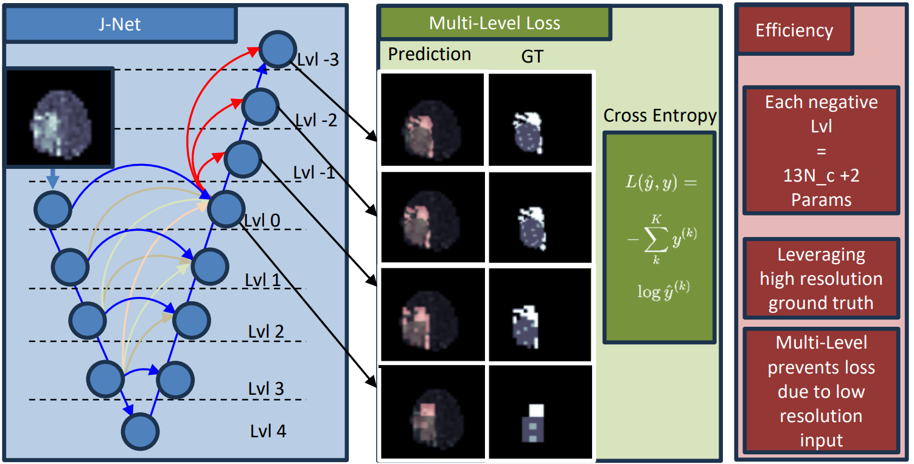
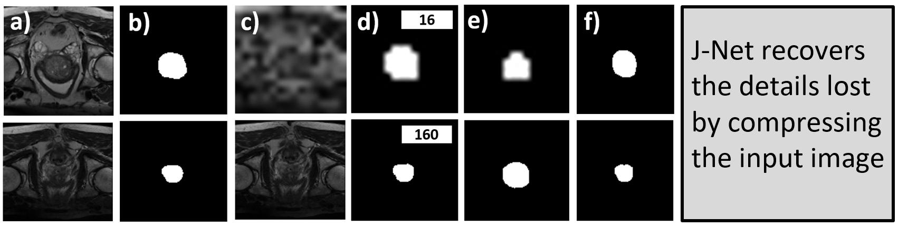

# J-Net: A Low-Resolution Lightweight Neural Network for Semantic Segmentation in the  Medical field for Embedded Deployment - ISVC 2024

When deploying neural networks in real-life situations, the size and computational effort are often the limiting factors. 
This is especially true in environments where big, expensive hardware is not affordable, like in embedded medical devices, where budgets are often tight. 
State-of-the-art proposed multiple different lightweight solutions for such use cases, mostly by changing the base model architecture, not taking the input and output resolution into consideration. 
In this paper, we propose the J-Net architecture that takes advantage of the fact that in hardware-limited environments, we often refrain from using the highest available input resolutions to guarantee a higher throughput. 
Although using lower-resolution input leads to a significant reduction in computing and memory requirements, it may also incur reduced prediction quality. 
Our J-Net architecture addresses this problem by exploiting the fact that we can still utilize high-resolution ground-truths in training. 



## How to use

The script train_16.py and train_32.py contains all the necessary steps for training the network at the respective resolution, please make the appropiate changes for the different resolutions.

## Requirements
- `python > 3.10`
- `pytorch > 1.7.`

### Training and Testing

1) You can find links for the Decathlon Prostate and Brats dataset from [here](https://github.com/gaurav104/WSS-CMER/tree/main).


2) Run the below code to train J-Net on the Decathlon Prostate dataset with image sizes of 16 and 32.
    ```bash
    python train_16.py     
    ```
    
   ```bash
    python train_32.py 
    ```

    
## Results
Qualitative segmentation results DECATHLON



## Acknowledgements

We gratefully thank the authors of [https://github.com/FrexG/ELU-Net-pytorc](https://github.com/FrexG/ELU-Net-pytorch), from which some parts of our code are inspired.

